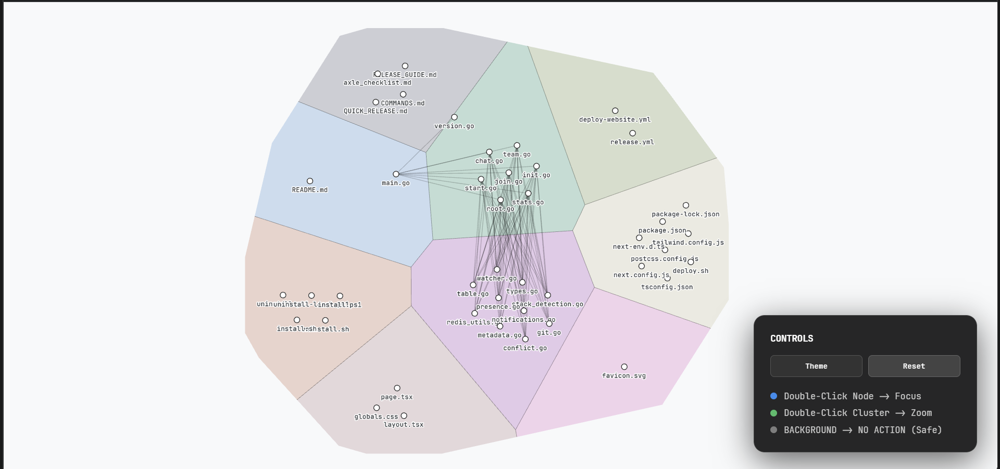

Onboarder is a VS Code extension that helps developers quickly understand unfamiliar codebases by surfacing high-level structure and key signals. It analyzes the project filesystem, applies configurable ignore rules, and computes language and size distributions to identify what actually matters in a repository. The results are presented in a persistent side panel designed for fast orientation, not exhaustive documentation. Onboarder focuses on clarity and signal over noise, providing a foundation for deeper semantic analysis as projects grow.
---

